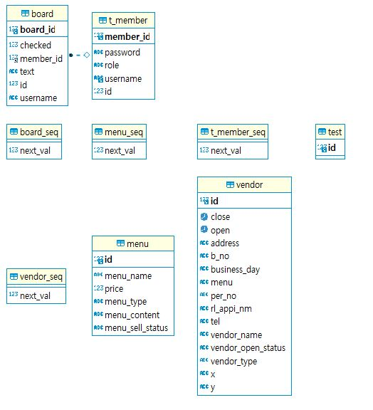
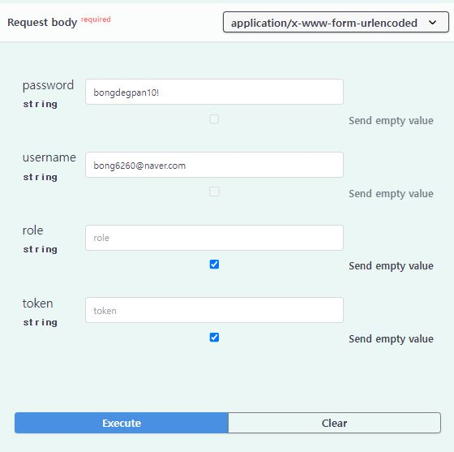
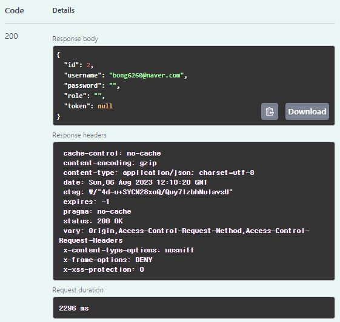
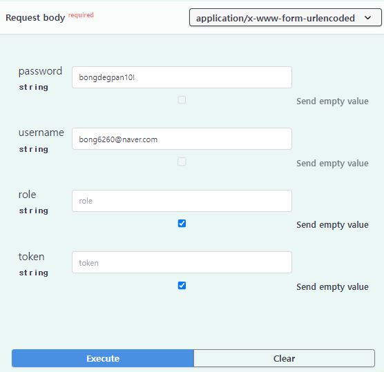
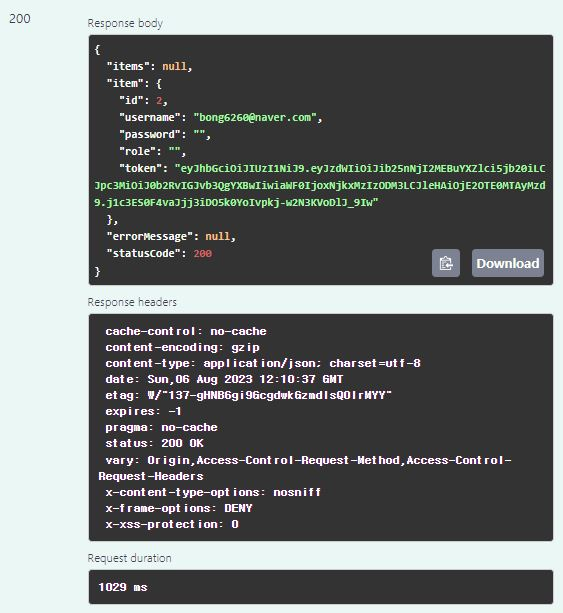
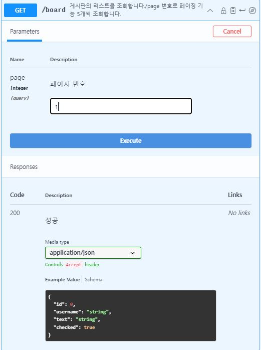
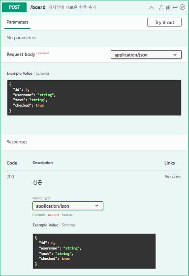
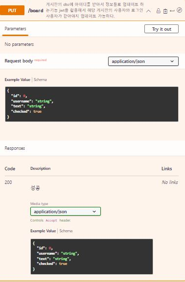
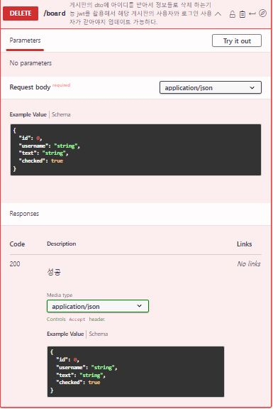
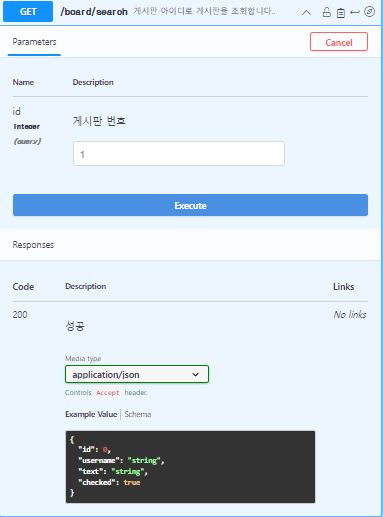

# wanted-pre-onboarding-backend
안녕하세요 백앤드 지원자 심봉교입니다.

# 애플리케이션의 실행 방법 (엔드포인트 호출 방법 포함)
<h4>101.101.210.23:80/member/join  회원가입

101.101.210.23:80/member/login 로그인 

101.101.210.23:80/board 게시판기능 
</h4>

# 데이터베이스 테이블 구조

# 구현한 API의 동작을 촬영한 데모 영상 링크

# 구현 방법 및 이유에 대한 간략한 설명
### board 의 정보들을 restful하게 받고 CRUD기능을 만들고 jwt 을 이용해서 해당 사용자만 수정 삭제 가능하게 만들었습니다.
### member join을 할때 이메일형식 , 비번 8자이상 이여야하고 login 할때 도 마찬가지고 이메일형식 비번 8자 이상 이여야합니다.
### 기본 보드 기능을 만들고 다음으로 메뉴와 상점기능을 만들어서 예약 시스템을 구축할려고 이 시스템을 만들었습니다.

# API 명세(request/response 포함)

  ### [API 명세서](https://app.swaggerhub.com/apis/SIMBONGGYO_1/wanted-pre-onboarding-backend/1.0.0)

<h4> 회원가입 http://101.101.210.23:80/member/join </h4>
  
 
   
   
<h4> 로그인 http://101.101.210.23:80/member/login </h4>

<h4> 게시판 기능 http://101.101.210.23:80/member/board

<h5>게시판 리스트 조회</h5>

<h5>게시판 생성</h5>

<h5>게시판 업데이트</h5>

<h5>게시판 삭제</h5>

<h5>해당 게시판 조회</h5>

